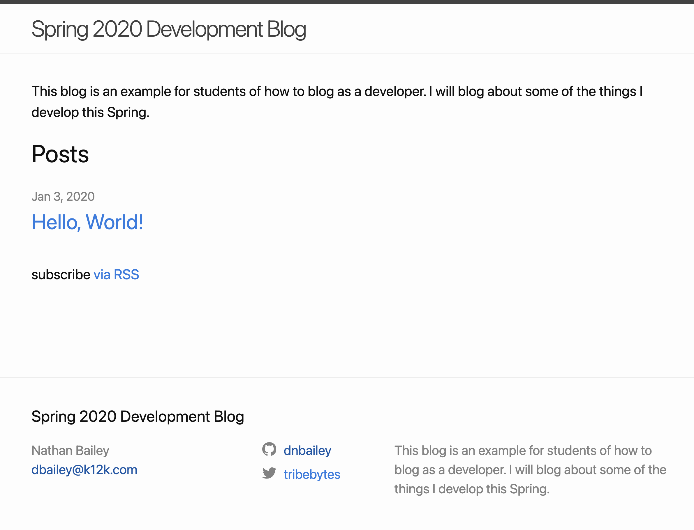

## What will I learn in this unit?

We're just getting started. The goal of this unit is to get you comfortable with Canvas and to introduce the ways you'll be graded on the assignments we complete in class. Additionally, we will have a chance to explore some careers in Computer Science (CS).

## What will I make in this unit?

At the end of the unit, you have built a developer blog that we will use throughout the semester. Blogging is a typical developer activity that allows you to reflect on your work, publish your progress, and get noticed by potential employers.

Check out my example at [mrbailey.codes/2021-Dev-Blog](http://mrbailey.codes/2021-Dev-Blog/)

{: style="border: 1px solid #ccc"}

## Objectives

- Understand and demonstrate the use of Canvas to submit assignments and complete activities.
- Understand the course standards and how assignments are graded.
- Create a presentation that explores and evaluates a CS career that interests you.

## Essential Questions

- What careers are related to Computer Science?
- What kinds of skills, knowledge, and credentials are necessary to be successful in a Computer Science career?
