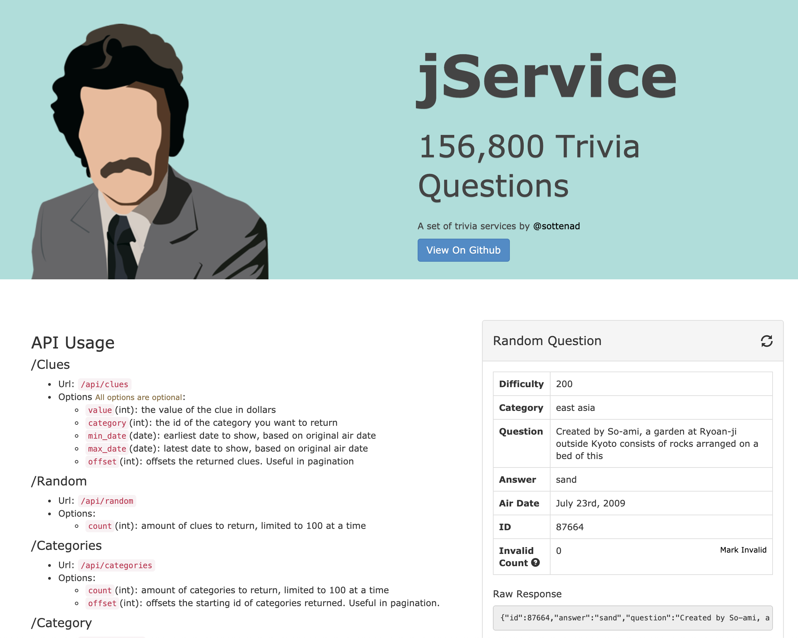

## What will I learn?

- How to create a front-end application using React.js.
- How to apply the concept of state to your application.
- How to connect to a public REST API and consume data for a Front-End UI.
- How to infer and draw conclusions from software documentation that will help you build your application.

## What will I make?

You'll be building a front-end user interface for a REST API. The REST API is a publicly accesible backend that will provide data in JSON format.

### REST API Choices

- [pokeapi.co](https://pokeapi.co/)
- [swapi.dev](https://swapi.dev/)
- [math.tools/api/numbers](https://math.tools/api/numbers/)
- [restcountries.eu](https://restcountries.eu/)

You may choose another option if you'd like, but I need to approve it before you begin working.

### Project Guidelines

Your app must:

- have at least two pages
- consume data from at least two different API endpoints
- use a form element as input to fetch data
- utilize state to update the UI
- contain at least two custom components
- be free of bugs and have proper commenting

### Success Criteria

- Purpose of the app is clear and relevant to the data
- UI is easy to navigate and visually attractive
- App works as intended with no errors

## Demo Project

In order to demonstrate some of the techniques you'll need to complete this assignment, I'll be using a Jeopardy REST API to create a triva game.

<small>[http://jservice.io/](http://jservice.io/)</small>

 



## Standards Assessed in This Unit

- **CRD1** - For practical intent, personal expression, or to address a societal issue, developers design and iteratively develop computational artifacts.
- **CRD2** - Incorporating feedback from users, developers systematically design and develop programs for broad audiences.
- **AAP1** - To find specific solutions to generalizable problems, developers represent and organize data in multiple ways.
- **AAP2** - The way statements are sequenced and combined in a program determines the computed result. Developers incorporate iteration and selection constructs to represent repetition and make decisions to handle varied input values.
- **AAP3** - Developers break down problems into smaller and more manageable pieces. By creating procedures and leveraging parameters, developers generalize processes that can be reused. Procedures allow developers to draw upon existing code that has already been tested, allowing them to write programs more quickly and with more confidence.
